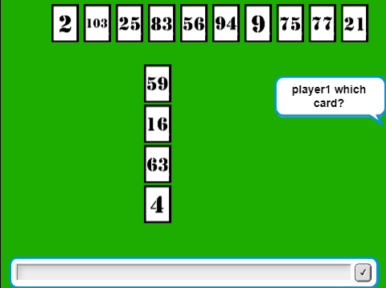

# 6Nimmt!
6 Nimmt! / Take 6! is a card game for 2–10 players designed by Wolfgang Kramer in 1994 and published by Amigo Spiele. The French version is distributed by Gigamic. This game received the Deutscher Spiele Preis award in 1994.

## Gameplay:
There are some important rules for playing this game. İn the beginning of the game, there is a screen which represents the game mode selection screen. İf player or players want to choose the single player game mode, it is necessary to press key up on keyboard, if it will be multiplayer, pressing key down will be enough. İn every round, player will be questioned which card he or she will play, in that case, player will enter the card’s number, not its index in that list. And after that, if player questioned by the computer for to choose a deck, player will choose a number between 1 and 4. The numbers between 1 and 4 represents 4 different deck on the table. At the end of the 7 rounds, the all players penalty points will be seen on the screen one by one and after that, computer announces the winner. If you press spacebar, the game will be automatedly goes the start screen.

## Screens of Game
The images you see below are shared in order to get a general idea about the interface of the game.

### 

  
  

### Win Screens
 

  
  

 

  
  

